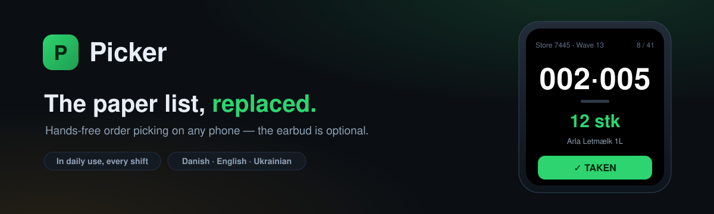

# Picker

> Hands-free, paper-free order picking that runs on any phone.

**Picker** replaces the paper picking list on a distribution-warehouse floor. It
reads out each location, lets the worker confirm every pick with a single click
or tap, records exactly what was taken (shortages and zeros included), and adds
up the shift totals automatically. No install: it runs in the browser and works
**with or without** a single earbud. The phone takes the place of the paper list.

## Links

| | |
|---|---|
|  **Live app** | https://thefleece.github.io/picker/ |
|  **Team demo** | https://thefleece.github.io/picker/demo.html |
|  **Pitch / overview** | https://thefleece.github.io/picker/pitch.html |
|  **Contact** | linnik.misha.2007@gmail.com |

## What it does

- **Next location, one at a time:** the app shows (and can speak) each spot and quantity.
- **One-tap confirm:** mark a pick with a single earbud click, or by tapping the screen.
- **"Less":** record the exact amount taken when the shelf is short, so zeros are precise.
- **Automatic shift log:** orders done, totals and pace, with no second sheet to add up by hand.
- **Works on any phone:** the earbud is a bonus, not a requirement.

## How you use it

| Mode | How it works |
|------|--------------|
|  **With one earbud** | It reads out each location in your ear; one click means "taken". Both hands stay on the goods. |
|  **No headphones** | The phone lies where the paper used to. Glance at it and tap what you took. |

**Controls:** `1 click = taken` · `2 = back` · `3 = pause`, or the on-screen buttons.

## Team demo

A separate, click-through [**team demo**](https://thefleece.github.io/picker/demo.html)
shows how it works once orders come straight from the warehouse system instead of
paper. Orders arrive as a **FIFO queue** (you get the next one in line, never just
the big ones), each shortfall is captured in one tap, a live shift log totals every
order, and an **office view** shows the same data the office would see. All of it
stays inside the company: no camera, no external service, nothing to install, and
it runs on any phone, offline.

## Languages

Interface and voice in **Danish · English · Ukrainian**.

## Tested on

**iPhone 12** (latest iOS), **AirPods 4**, **Safari**, including installed to the
Home Screen as a web app.

## Ownership & license

Picker (source code, interface, design, and wording) was created and is owned
**solely by Mykhailo Lynnyk**, developed independently, in personal time, on
personal equipment.

This repository is public for demonstration purposes only. **It is not open
source.** All rights are reserved; see [LICENSE](LICENSE). No part of this
project may be copied, reused, hosted, modified, or redistributed without the
author's written permission.

## Status

A personal working tool and proof of concept, in daily use. A short pilot
proposal for warehouse deployment is available on request.

---

**Mykhailo Lynnyk** · linnik.misha.2007@gmail.com
